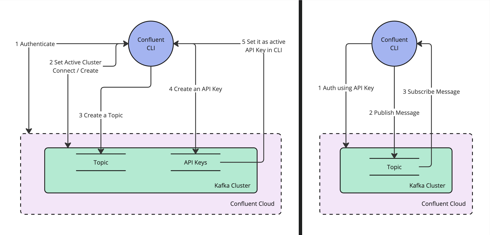

# Day 1: Write your first data record and read it in real time

## Tutorial
[Apache Kafka Quickstart](https://developer.confluent.io/quickstart/kafka-on-confluent-cloud/?build=apps)

## Pre-requisite (Mac):
1. Install Xcode command line `xcode-select --install`
2. Install Homebrew
3. Install [Confluent](https://docs.confluent.io/confluent-cli/current/install.html#install-confluent-cli) CLI
