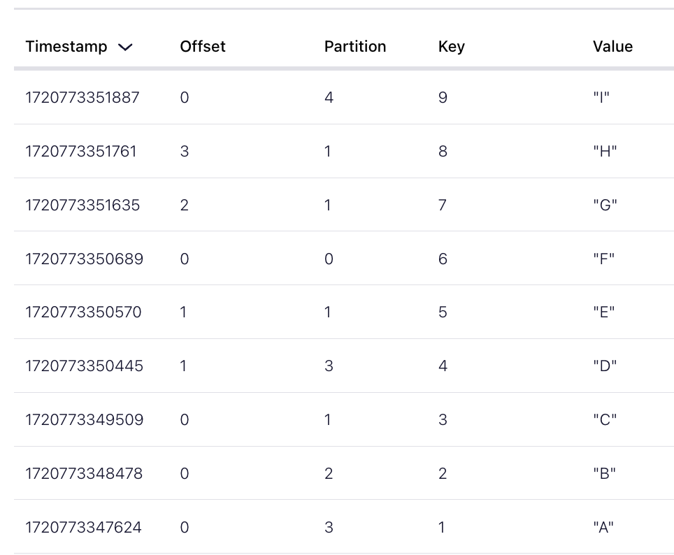

# PARTITIONS

Partitions allow to divide a topic into smaller chungs and distribute it across different nodes. Its a simple way to have distributed system capabilities in your Kafka cluster.

Events can be sent to different partitions in two ways:
1. Round-Robin: In this case the events are sent to partitions in sequence as per their availability without retaining the order of the events.
2. Key: In this approach, each event has a key associated with them that is passed through a hash function. The hash function then returns the modulous based on the number of partitions. Key can be anything tht's uique, for example customerId. This approach allows the events to be distributed in an orderly fashion.

List all topics in your current cluster:

```sh
confluent kafka topic list
```

See more information about a topic:

```sh
confluent kafka topic describe TOPIC_NAME
```

Create two new topics with partitions 3 and 5:

```sh
confluent kafka topic create --partitions 3 ps3
confluent kafka topic create --partitions 5 ps5
```

```sh
confluent kafka topic list

     Name    | Internal | Replication Factor | Partition Count
-------------+----------+--------------------+------------------
  ps3        | false    |                  3 |               3
  ps5        | false    |                  3 |               5
  quickstart | false    |                  3 |               1
```

Let's delete quickstart and create a new topic with 1 partition:

```sh
confluent kafka topic delete quickstart
confluent kafka topic create --partitions 1 ps1
```

Let's first produce the messages to ps1:

```sh
confluent kafka topic produce ps1
# WRITE ANY MESSAGE HERE
```

If you want to listen to the message then run:

```sh
confluent kafka topic consume ps1
```

Or, if you want to listen all the messages from begining

```sh
confluent kafka topic consume ps1 --from-beginning
```

Since ps1 topic has only 1 partition, all the messages will only go to 1 partition. Next, let's pass the message with key and values and let Kafka distribute them to different partitions.

Let's use this data:

```sh
1: "A"
2: "B"
3: "C"
4: "D"
5: "E"
6: "F"
7: "G"
8: "H"
9: "I"
```

Now, lets produce this message once in ps3, and once in ps5:

```sh
confluent kafka topic produce ps3 --parse-key

# ENTER DATA and Hit Ctrl+C / Ctrl+D to return

confluent kafka topic produce ps5 --parse-key
```

Now, got to your Confluent cloud console and see how the messages are distributed in ps3 and ps5. Kafka automatically calculated hash based on keys and distributed messages across different partitions for the same topic. Below screenshot shows for the topic `ps5` with **5** partitions.


